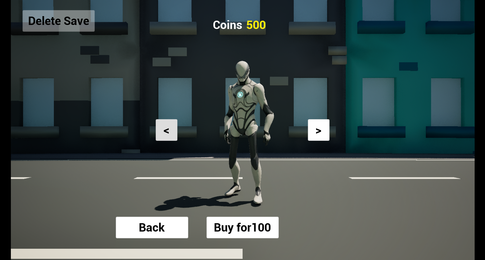
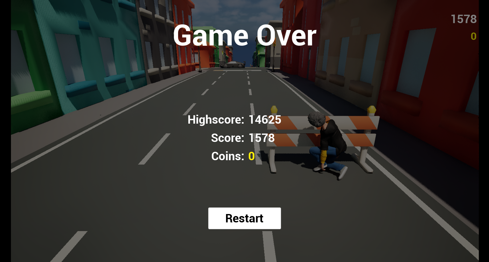
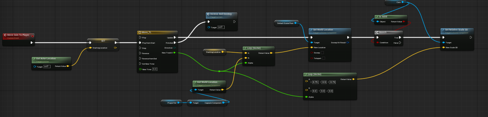

# 🏃‍♂️ 3D Endless Running Game – Unreal Engine

A **fast-paced 3D endless running game** built in **Unreal Engine**.  
Run, jump, and dodge obstacles to survive as long as you can — test your reflexes and beat your own high score!

---

## 🎮 About the Game

This project is a **3D Endless Runner** where the player automatically moves forward through an infinite path.  
The goal is simple — **avoid obstacles, collect points**, and **survive as long as possible** while the game speed gradually increases.

---

## 🧠 Key Features

- 🌀 **Procedural Tile Spawning** – Automatically generates new road tiles endlessly.  
- ⚙️ **Game Manager System** – Controls game flow, player respawn, and tile generation.  
- 💥 **Obstacle & Coin Spawning Logic** – Dynamic placement with collision detection.  
- 🪙 **Coin Collection System** – Score increases as player collects coins.  
- 🔁 **Dynamic Difficulty** – Speed and challenge increase over time.  
- 🎵 **Sound Effects & Background Music** – Immersive audio for better gameplay.  
- 🎨 **Custom 3D Assets & Materials** – Designed for a polished and vibrant look.  
- 🧩 **Blueprint + C++ Mix** – Uses Unreal Engine Blueprints for visual scripting and logic control.  

---

## 🏗️ Technologies Used

| Technology | Purpose |
|-------------|----------|
| **Unreal Engine 5** | Game Engine |
| **Blueprints (Visual Scripting)** | Game Logic and Interactions |
| **C++ (Optional)** | Extended Functionality |
| **3D Models & Materials** | Environment and Gameplay Assets |
| **Sound FX & Music** | Audio Experience |

---

## 🕹️ How to Play

1. **Launch the game** from Unreal Engine or packaged build.  
2. Your character starts running automatically.  
3. **Use Arrow Keys / A & D / Swipe (mobile)** to move left or right.  
4. **Avoid obstacles** and **collect coins** to increase your score.  
5. Keep running — the speed and challenge increase over time!

---

## 📁 Project Structure

Endless_Running_Game/
│
├── Source/ # C++ source files (if used)
├── Content/ # Game assets (3D models, sounds, materials)
│ ├── Blueprints/ # Main game logic (player, tiles, game manager)
│ ├── Materials/ # Visual styles
│ ├── Meshes/ # 3D models
│ └── UI/ # HUD and score display
│
├── Config/ # Unreal Engine configuration files
└── README.md # You’re reading it :)
---

## 🧩 Game Logic Overview

- **Tile Spawning System:**  
  New tiles are generated as the player moves forward. When the player passes a certain point, a new tile spawns seamlessly.

- **Coin & Obstacle Logic:**  
  Coins and obstacles are spawned dynamically with logic to prevent impossible combinations.

- **Score System:**  
  Each collected coin increases score, displayed in the UI HUD.

- **Game Manager:**  
  Handles the tile spawning, player respawn, and overall game control.

---

## 🚀 Future Improvements

- 🧍 Add new playable characters  
- 🗺️ Introduce new environments and biomes  
- ⚡ Power-ups and special abilities  
- 🌍 Multiplayer or leaderboard system  
- 📱 Android & iOS packaging  

---

## 🎯 Learning Objective

This project was developed as part of my **Diploma in Computer Engineering** to:
- Learn **Unreal Engine fundamentals**  
- Understand **Blueprint scripting**  
- Explore **game mechanics like collision, spawning, and scoring**  
- Build a **complete playable game prototype**

---

## 🧑‍💻 Developed By

**👨‍🎮 Manjeet Dhiman**  
> Turning ideas into virtual worlds | Learning Unreal Engine & Game Development  

📍 **GitHub:** [ManjeetJr](https://github.com/ManjeetJr)  
📷 **Instagram:** [@manjeet__jr *(https://www.instagram.com/manjeet__jr/)*  

---

## 📸 Screenshots / Gameplay

---

## 🏁 Conclusion

This **3D Endless Running Game** demonstrates how simple mechanics, procedural generation, and creative design come together to make an addictive and fun experience.  
Built with passion and curiosity — a step toward becoming a **Game Developer**. 🎮✨

---

> “Reality is overrated — I’m building my own in Unreal.” 💫
